# 多旋翼总体设计一览表

---

## 系统架构概览

<table align="center" style="margin: 0 auto; text-align: center">
  <thead>
    <tr><th>系统</th><th>组件</th></tr>
  </thead>
  <tbody>
    <tr>
      <td rowspan="3"><strong>动力系统</strong></td>
      <td>电机</td>
    </tr>
    <tr><td>螺旋桨</td></tr>
    <tr><td>电调</td></tr>
    <tr>
      <td rowspan="3"><strong>传感系统</strong></td>
      <td>光流测距仪</td>
    </tr>
    <tr><td>深度相机</td></tr>
    <tr><td>广角单目相机</td></tr>
    <tr>
      <td><strong>控制系统</strong></td>
      <td>飞控</td>
    </tr>
    <tr>
      <td rowspan="2"><strong>通信系统</strong></td>
      <td>接收机</td>
    </tr>
    <tr><td>WIFI 模块</td></tr>
    <tr>
      <td rowspan="3"><strong>供电系统</strong></td>
      <td>电池</td>
    </tr>
    <tr><td>飞控降压模块</td></tr>
    <tr><td>机载电脑降压模块</td></tr>
    <tr>
      <td><strong>计算系统</strong></td>
      <td>机载电脑</td>
    </tr>
  </tbody>
</table>

---

## 1. 动力系统

### 1.1 电机

- **型号**：Axisflying 酷飞 AE2207 V2（1960KV）
- **适用**：FPV 穿越机 5 寸无人机
- **主要参数**：

| 参数 | 规格 |
|------|------|
| KV 值 | 1750 / 1960 |
| 槽极数 | 12N14P |
| 电机尺寸 | Ø27.5 × 33.2 mm |
| 轴径 | 4 mm，螺纹 M5，螺纹段长 13.8 mm |
| 安装孔 | 4-M3，螺栓圆 Ø16 mm |
| 工作电压 | 6S |
| 最大功率 | 771.9 W |
| 最大拉力 | 1634 g |
| 最大电流 | 32.46 A |
| 内阻 | 71.53 mΩ |
| 空载电流(10V) | 0.89 A |
| 硅胶线 | 20# 150 mm |
| 重量(含线) | 35.2 g |
- **购买链接**：[Axisflying酷飞AE2207 V2 FPV穿越机5寸无人机航模无刷电机马达 - 淘宝网](https://s.taobao.com/search?q=Axisflying%E9%85%B7%E9%A3%9EAE2207+V2+FPV%E7%A9%BF%E8%B6%8A%E6%9C%BA)

| 实物 | 尺寸图 | 参数表 |
|------|--------|--------|
| 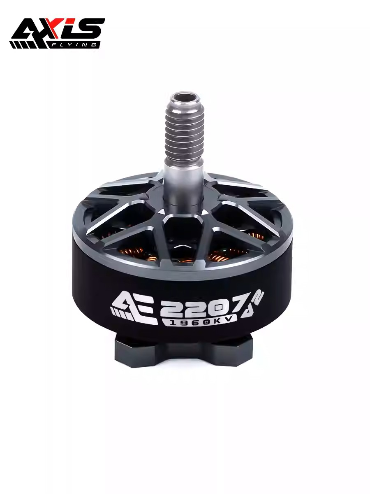 | 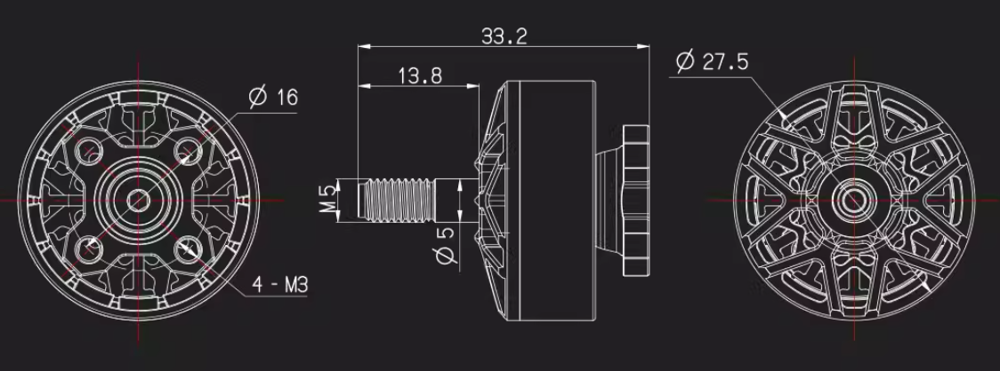 | 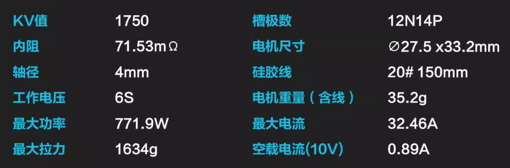 |

### 1.2 电调

- **型号**：Axisflying 酷飞 F405 飞塔（含 F405 飞控）
- **规格**：8 位 60A 电调四合一
- **飞控部分（Argus ECO FC F405）**（来自文档附图）：
  - 固件：SPEDIX F405 (Betaflight)
  - MCU：STM32F405RGT6
  - 陀螺仪：ICM42688P；气压计：支持
  - BEC：5V 3A / 12V 2A；串口：5 个；OSD / 黑匣子：支持，16M
  - 输入电压：4~8S；尺寸：36×36×6 mm；安装孔距：30.5×30.5 mm；重量：7 g
- **购买链接**：[Axisflying酷飞FPV穿越机飞塔F405飞控无人机8位60A电调四合一 - 淘宝网](https://s.taobao.com/search?q=Axisflying%E9%85%B7%E9%A3%9EFPV%E7%A9%BF%E8%B6%8A%E6%9C%BA%E9%A3%9E%E5%A1%94F405)

飞控接线示意（正面/反面）：

| 正面 | 反面 |
|------|------|
| 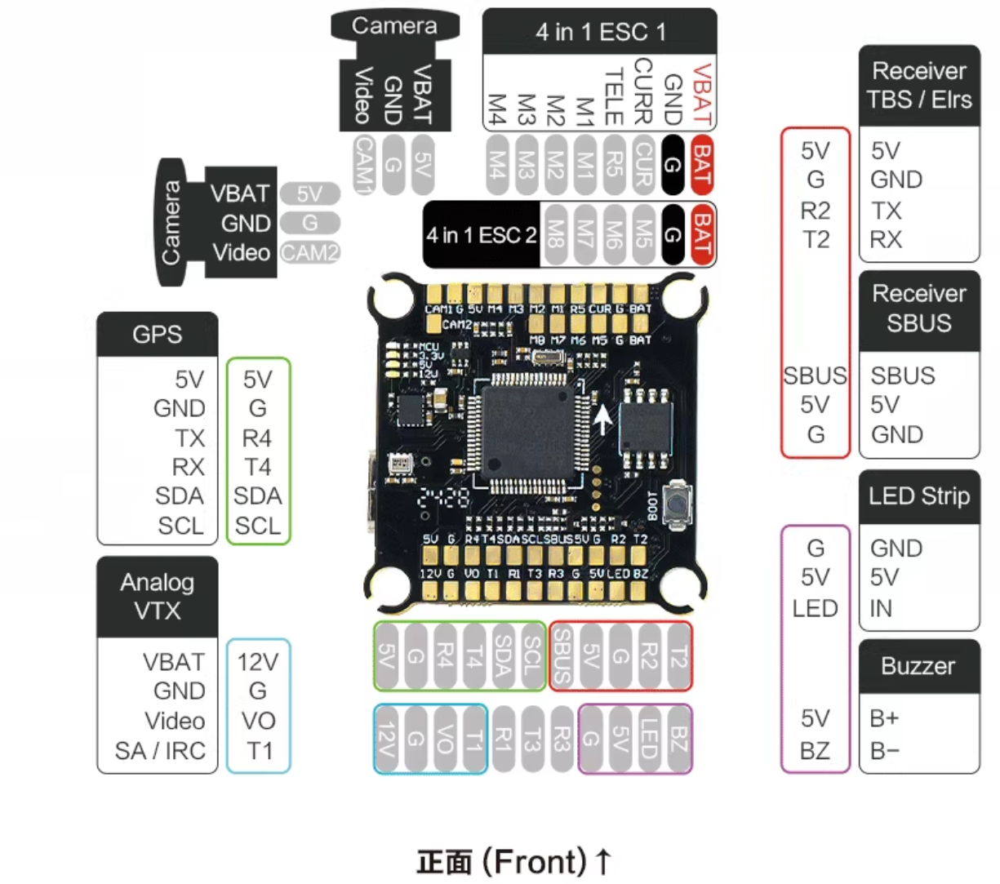 | 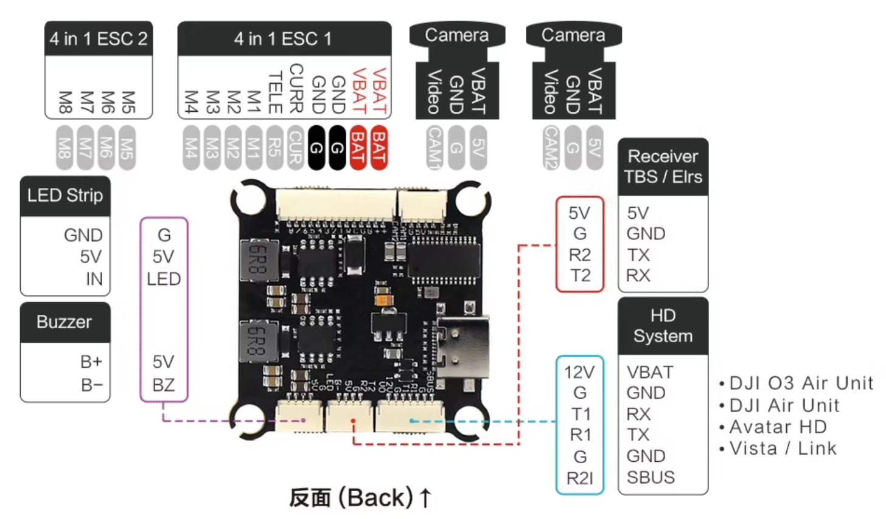 |

*接线包含：摄像头 CAM1/CAM2、四合一电调 M1–M8、GPS、模拟图传、接收机 TBS/Elrs/SBUS、LED、蜂鸣器、HD 系统等。*

### 1.3 螺旋桨

- **型号**：Axisflying 酷飞 BB39 桨叶黑鸟联名 V2 三叶桨
- **适用**：FPV 穿越机 5 寸螺旋桨
- **主要参数**（来自文档附图）：
  - 尺寸：4.9 英寸；桨盘直径：126 mm；最大桨叶宽度：14.6 mm
  - 螺距：2.6；材质：PC；孔径：5 mm；桨毂厚度：6 mm
  - 重量：3.7 g
  - 颜色：透明蓝 / 透明橙 / 透明灰
  - 推荐搭配电机：BB 2207 V3 / AE 2207 V2
- **购买链接**：[Axisflying酷飞BB39桨叶黑鸟联名V2三叶桨FPV穿越机5寸螺旋桨叶片 - 淘宝网](https://s.taobao.com/search?q=Axisflying%E9%85%B7%E9%A3%9EBB39%E6%A1%A3%E5%8F%B6)

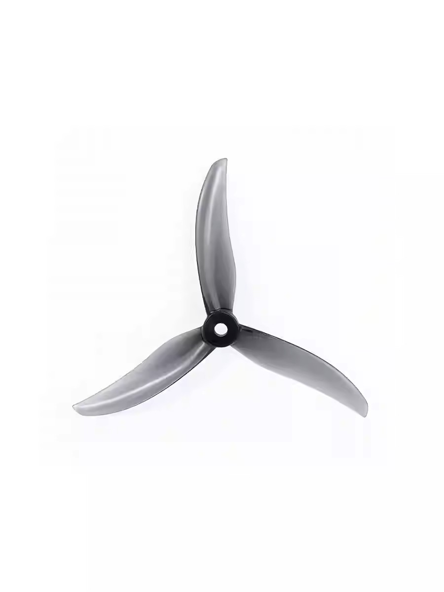  
*图：三叶桨实物。*

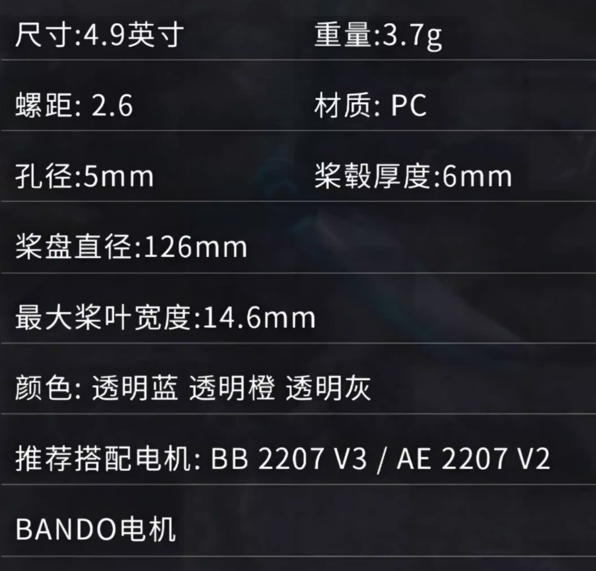

---

## 2. 传感系统

### 2.1 光流测距仪

- **型号**：micoair MTF-01（光流 + 激光测距一体）
- **规格**（来自文档附图）：
  - 重量：4.5 g；尺寸：29×16.5×15 mm
  - 输出：UART；刷新频率：100 Hz
  - 测距范围：0.01–8 m；盲区：1 cm；精度：2%
  - 波长：830–870 nm；抗环境光：70K Lux
  - 测距 FOV：6°；光流 FOV：42°
  - 光流环境光需求：>60 Lux；光流工作距离：>80 mm
  - 功耗：500 mW；工作电压：4.0–5.5 V；工作温度：-10°C–60°C
- **购买链接**：[micoair MTF-01光流8米激光测距一体模组定位PMW3901传感器无人机 - 淘宝网](https://s.taobao.com/search?q=MTF-01%E5%85%89%E6%B5%81%E6%B5%8B%E8%B7%9D%E4%BB%AA)

| 模块实物（示例） | MTF-01 产品参数 |
|------------------|------------------|
| 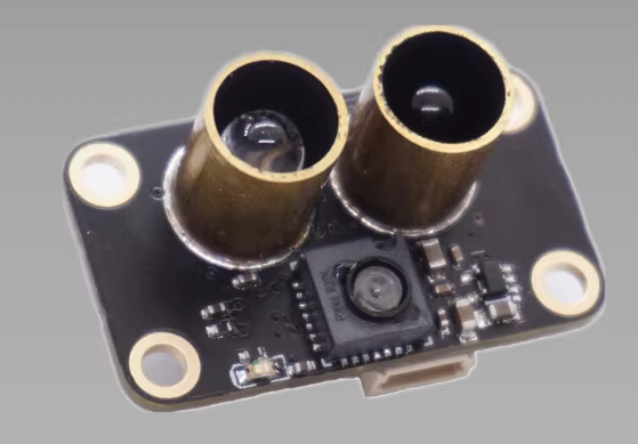 | 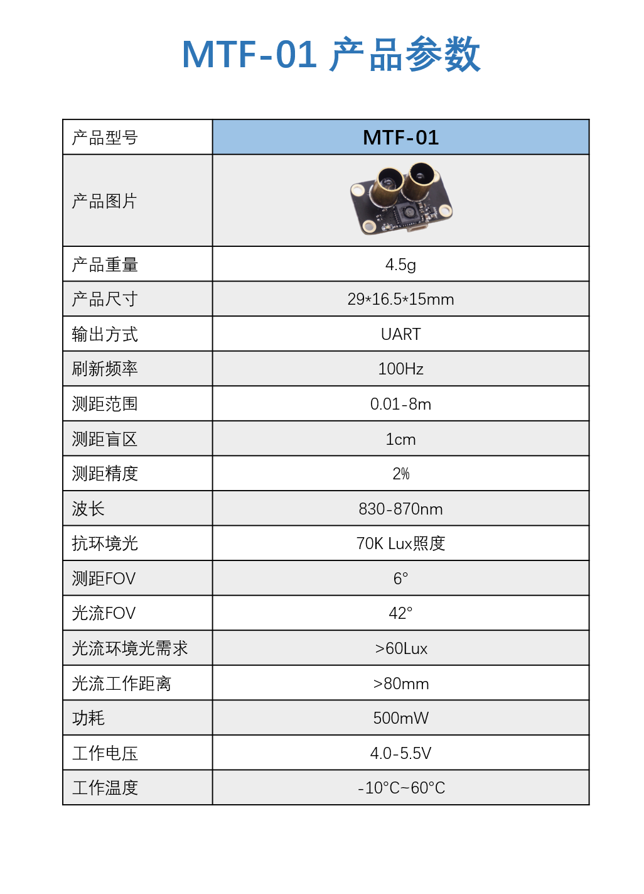 |

### 2.2 深度相机

- **型号**：英特尔 Intel RealSense D430+RGB / D415 / D435 / D435i
- **规格**（来自文档附图，D430+RGB）：
  - 感应技术：主动红外立体声（全球快门）
  - 深度/IR：最高 1280×720，90 fps；最近距离 0.3 m；约 10 m（视校准与场景而定）
  - RGB：1920×1080 @ 30 fps
  - 视场角：69.4°×42.5°×77° (±3°)
  - 接口：USB 3.0 Type-C
  - 安装：1× 1/4-20 UNC 螺纹，2× M3 螺纹
  - 尺寸：约 91.2×65.5×100.6 mm / 90×25×25 mm（模块）
- **购买链接**：[英特尔 Intel D415 D435 D435i深度实感相机 双目立体实感相机 - 淘宝网](https://s.taobao.com/search?q=Intel+D435+%E6%B7%B1%E5%BA%A6%E7%9B%B8%E6%9C%BA)

| 深度相机实物 | D430+RGB 规格 |
|--------------|----------------|
|  | 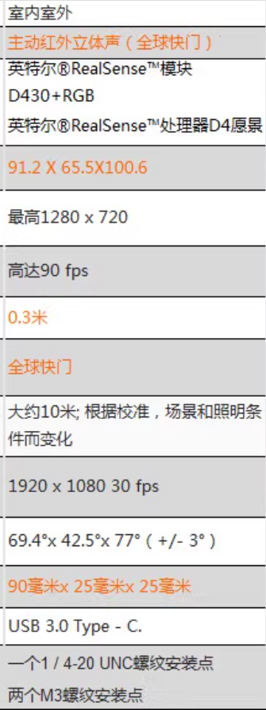 |

### 2.3 广角单目相机

- **状态**：Todo（待选型）

---

## 3. 控制系统

### 3.1 飞控

- **型号**：CUAV 雷迅 V5+
- **规格**：智能控制器开源飞控，兼容 Pixhawk / APM / PX4
- **硬件参数**（来自文档附图）：
  - 主处理器：STM32F765（32 位 Arm® Cortex®-M7，216 MHz，2 MB Flash，512 KB RAM）
  - 协处理器：STM32F100（32 位 Cortex®-M3，24 MHz，8 KB SRAM）
  - 传感器：加速计/陀螺仪 ICM-20602 / ICM-20689 / BMI055；电子罗盘 IST8310；气压计 MS5611×2
  - 接口：UART×5、I2C×4、SPI×1、CAN×2、ADC×2；PWM 输出 14 / 输入 6；PPM×1；DSM/SBUS/RSSI×1；Power1/2、安全开关、蜂鸣器、USB-Type-C、TF 卡槽
  - 固件：PX4 / ArduPilot；机型：多旋翼/固定翼/直升机/VTOL/无人船/无人车等；电源：三路电源输入冗余
  - 尺寸：85.5×42×33 mm；重量：91 g
- **购买链接**：[CUAV雷迅V5+智能控制器开源飞控pixhawk无人机船APM PX4 - 天猫](https://list.tmall.com/search_product.htm?q=CUAV%E9%9B%B7%E8%BF%85V5%2B)

| 飞控实物 | 规格参数 |
|----------|----------|
| 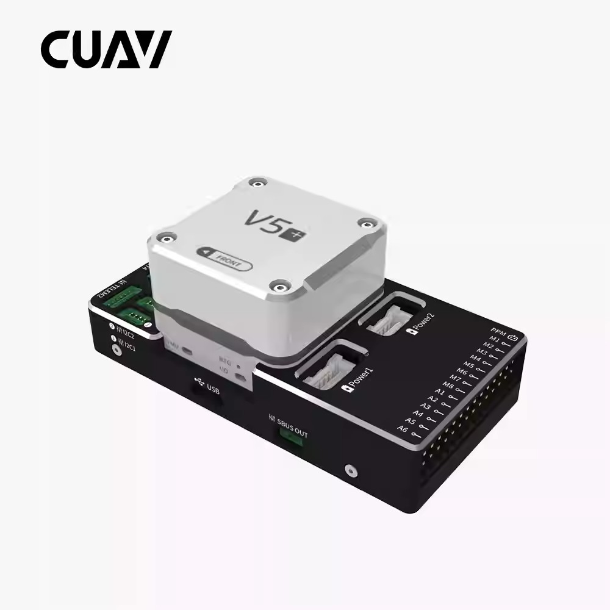 | 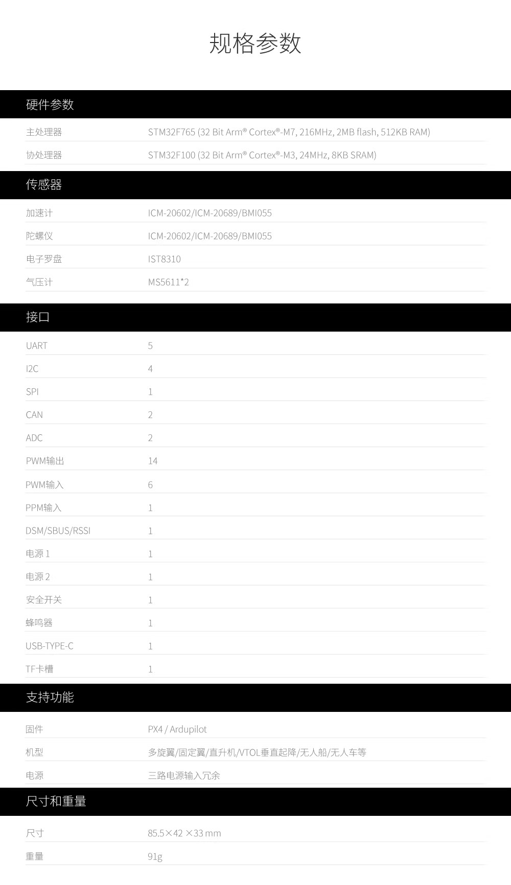 |

---

## 4. 通信系统

- 接收机
- WIFI 模块

*具体型号与购买链接待补充*

---

## 5. 供电系统

### 5.1 电池

- **品牌**：格氏 ACE（格氏正品）
- **规格**：1800/2200/3300/4000/5300/6000 mAh，4S/6S 动力锂电池；高倍率放电
- **示例**（来自文档附图）：GS33004S30 — 3300 mAh、4S1P、14.8 V、30C；XT60 主电源接口 + JST-XH 平衡头
- **购买链接**：[格氏ACE1800/2200/3300/4000/5300/6000mah4S/6S动力锂电池穿越机 - 淘宝网](https://s.taobao.com/search?q=%E6%A0%BC%E6%B0%8FACE%E7%A6%BB%E7%94%B5%E6%B1%A0)

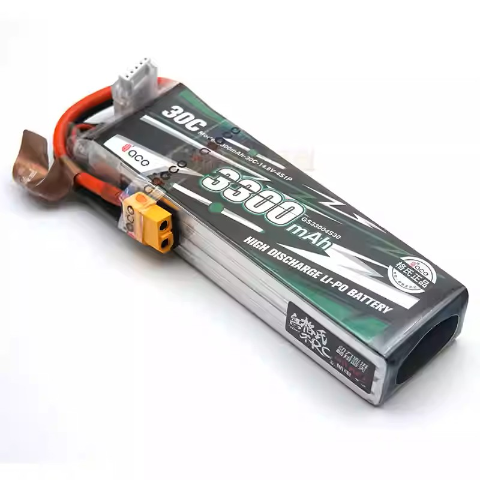

### 5.2 降压模块

*具体型号与购买链接待补充*

---

## 6. 计算系统

- **机载电脑**：用于路径规划、图像处理与高级控制；小型化主机（类 NUC 形态），前置 USB、网口、电源键等
- *具体型号与购买链接待补充*

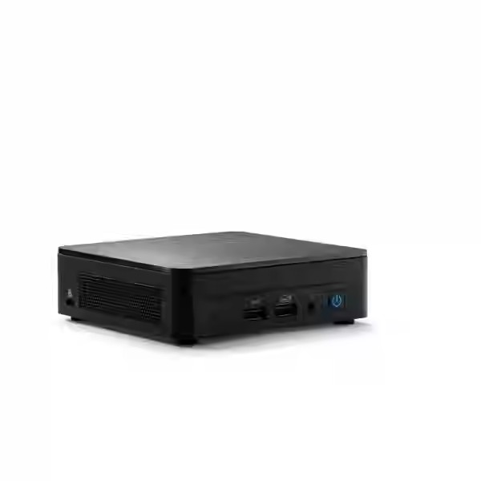

---

## 使用与复现说明

1. **硬件清单**：可依据本文档各章节采购对应组件。
2. **固件与调参**：飞控需刷写 PX4 或 ArduPilot 等固件，并完成传感器校准、电调校准与电机转向、混控配置。
3. **安全**：首次上电与试飞应在空旷、安全场地进行，螺旋桨旋转时保持安全距离。

---

*本文档随硬件迭代可能更新；具体型号与参数以实际器件与厂商说明为准。*
