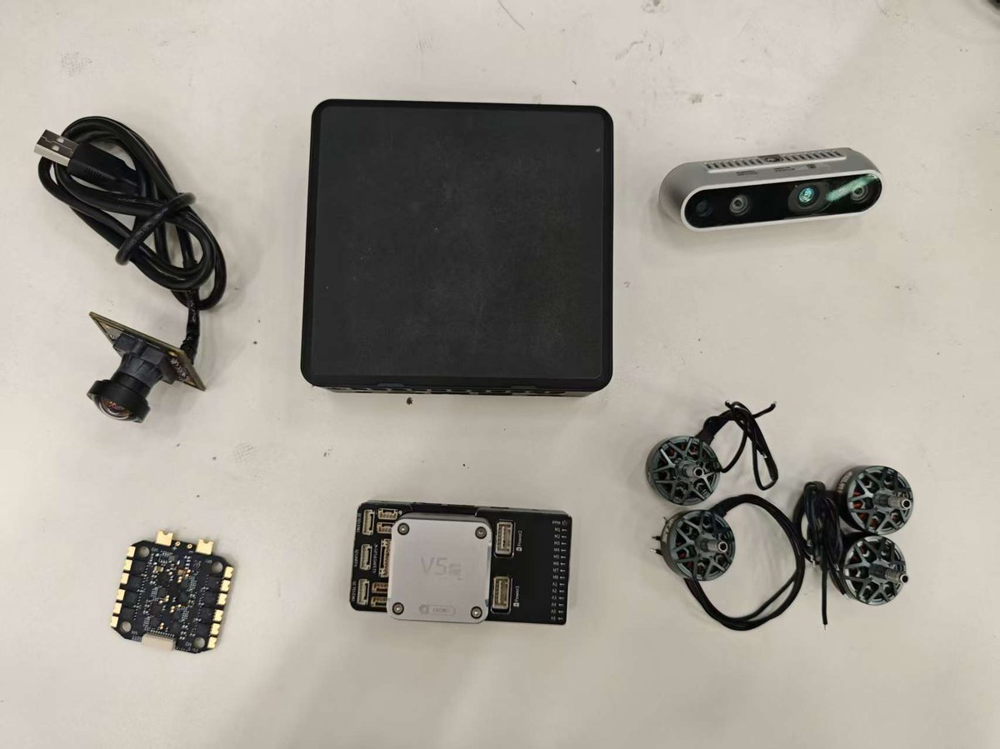
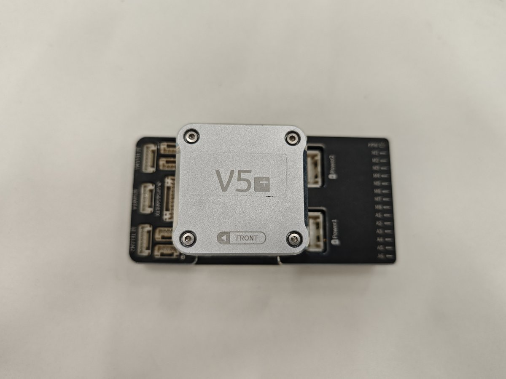
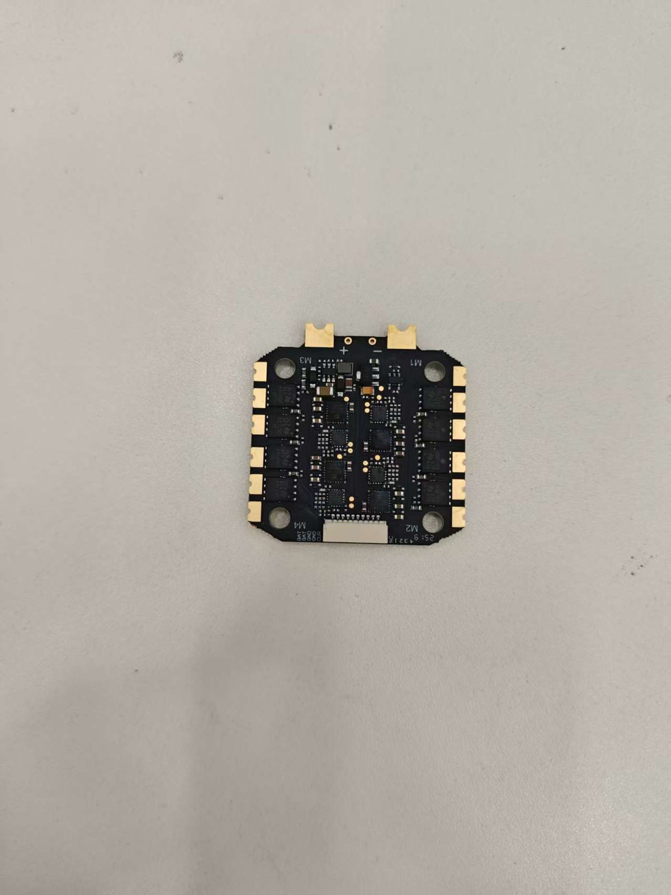
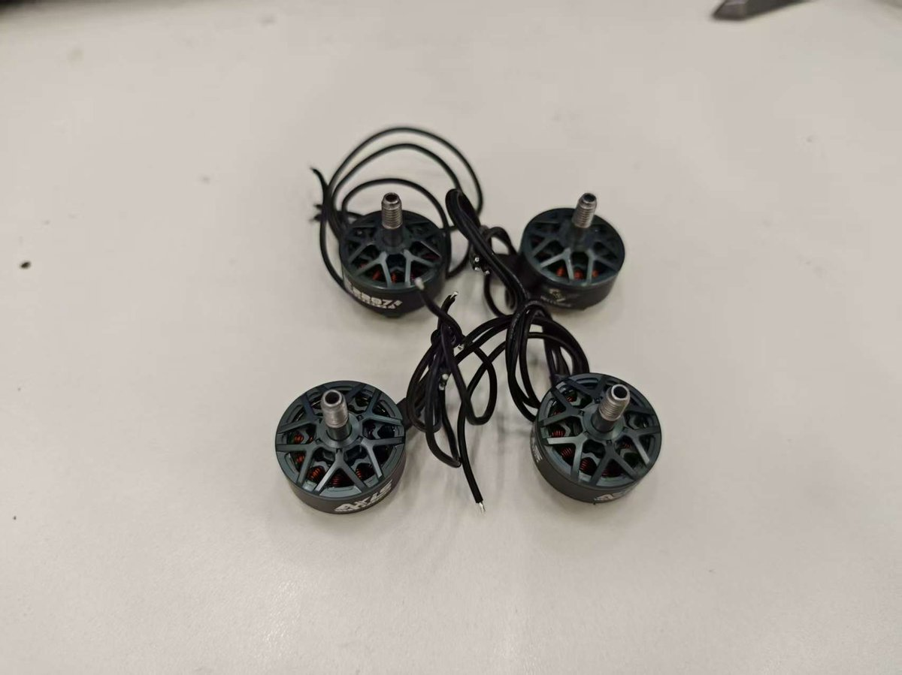
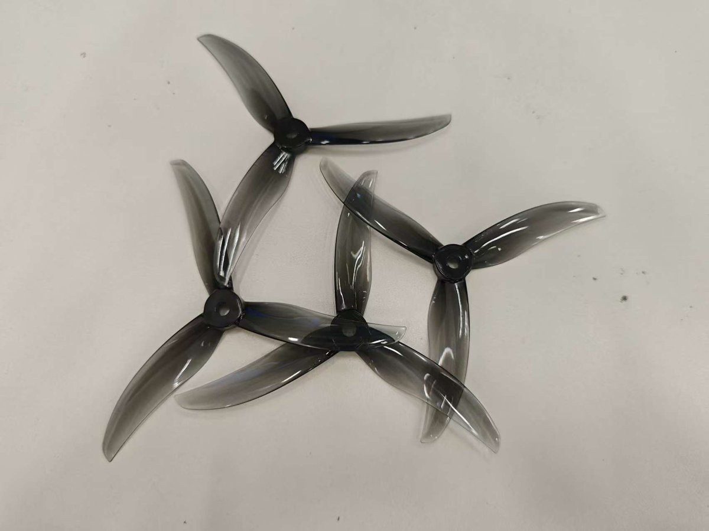

<h1 align="center">多旋翼飞行器实验平台搭建</h1>

作者：汤帅

## 摘要

本仓库记录了面向科研与教学用途的四旋翼（Quadrotor）飞行器实验平台的硬件选型与系统搭建过程。

---

## 1. 引言

四旋翼飞行器因其结构简单、机动性强、易于建模与控制，已成为无人系统与机器人领域常用的实验载体。本平台以**可复现、可扩展**为设计原则，选用成熟商用部件构建航电系统，便于在实验室环境下开展避障算法。

文档配套 `media/` 目录下的实物照片，对应各子系统的选型与接口说明，便于复现与二次开发。

---

## 2. 系统架构概览

平台航电系统采用“感知—决策—执行”分层结构：

| 层级     | 功能           | 硬件                     |
|----------|----------------|------------------------------|
| 感知层     | 视觉、深度、姿态 | 深度相机、广角单目4K摄像头         |
| 决策层 | 算法运行、接口扩展 | 机载电脑     |
| 控制层    | 姿态解算、导航  | 飞控              |
| 执行层     | 推力与姿态实现  | 电调、无刷电机、三叶桨       |
| 交互层 | 人机交互 | 遥控器 |

整体航电组件布局见下图（对应 `media/` 内总体照片）。

*图 1 四旋翼平台航电组件总览：计算单元、深度相机、飞控、电调板与无刷电机。*

---

## 3. 飞行控制系统（飞控）

飞控为平台的核心控制单元，负责 IMU 融合、姿态解算、电机混控及与上位机的通信。

本平台选用 **雷迅V5飞控**（Pixhawk 系列或兼容方案），主要特性包括：
- **接口**：  
  - 遥测：IN TELEM1 / IN TELEM2  
  - 辅助与 PWM：AUX、FMU PWM OUT  
  - 遥控输入：PPM IO  
  - 电机/电调输出：M1–M8（本平台使用其中四路）  
  - 模拟量：A1–A6  
  - 供电/数据：Power1、Power2（USB 型）

飞控通过 PWM 或 DShot 等协议向电调发送油门指令，进而驱动四路无刷电机，实现姿态与高度控制。

*图 2 飞控主控模块与载板接口布局。*

---

## 4. 电子调速器（电调）

电调将飞控的油门指令转换为三相驱动信号，驱动无刷电机转速与推力。

本平台采用 **四合一电调（4-in-1 ESC）**，单板驱动四路电机，具有以下特点：

- **结构**：方形黑色 PCB，四角带安装孔，便于固定在机架上。
- **电机输出**：四组焊盘 M1–M4，每组三焊盘对应无刷电机三相线。
- **电源**：顶部 “+” / “-” 焊盘接主电源（锂电）。
- **控制**：底部多针白色连接器（如 JST-GH）接收飞控 PWM/DShot 信号。
- **器件**：板载功率 MOSFET、电容、电阻等 SMD 元件，实现高集成度与轻量化。

四合一方案有利于减少线缆、降低重量与电磁干扰，适合小型与中型四旋翼平台。

*图 3 四合一电调 PCB 及 M1–M4、电源与控制接口。*

---

## 5. 动力系统：电机与螺旋桨

### 5.1 无刷直流电机（BLDC）

平台采用 **四台无刷直流电机**，型号为 **2207**（定子外径 22 mm，叠厚 7 mm），适用于 FPV 穿越机或 5 寸级四旋翼：

- **电气**：每台电机引出三根线，对应三相驱动，与电调 M1–M4 一一对接。
- **机械**：顶端带螺纹输出轴，用于安装螺旋桨。
- **结构**：外壳带散热孔，内部可见铜线绕组，兼顾散热与功率密度。

电机选型需与螺旋桨直径、桨距及电池电压匹配，以保证推力、效率与动态响应满足实验需求。

*图 4 四台 2207 无刷电机及三相接线。*

### 5.2 三叶螺旋桨

推力由 **三叶螺旋桨** 将电机旋转动能转化为升力/推进力。本平台所用桨叶特征如下：

- **结构**：中心轮毂 + 三片均匀分布的叶片，具明显扭角与气动外形。
- **材质**：半透明深灰塑料，轻质且便于目视检查损伤。
- **科研意义**：桨叶数量、直径、螺距与材质是影响效率、噪声与负载能力的重要参数，可在本平台上进行对比实验。

桨叶安装时需区分正反桨（如 2 正 2 反），并确保锁紧，防止射桨。

*图 5 三叶螺旋桨外形与结构。*

---

## 6. 感知与计算单元（见总体图）

根据 `media/总体航电.jpg`，平台还包含：

- **小型 USB 摄像头**：可用于 FPV、环境感知或算法调试。
- **黑色计算单元/主控箱**：疑似迷你 PC 或嵌入式计算机（如 Jetson），用于路径规划、图像处理或高级控制。
- **深度/视觉惯性传感器**：椭圆形、双目+红外结构，类似 Intel RealSense，用于深度估计与 VIO，支撑自主导航与避障。

上述部件通过飞控或机载计算机的 USB/串口与系统连接，具体接线与驱动需结合所选型号的官方文档配置。

---

## 7. 使用与复现说明

1. **硬件清单**：可依据本文档与 `media/` 中照片采购飞控、四合一电调、2207 电机、三叶桨、电池、机架及感知/计算单元。
2. **固件与调参**：飞控需刷写 PX4 或 ArduPilot 等固件，并完成传感器校准、电调校准与电机转向、混控配置。
3. **安全**：首次上电与试飞应在空旷、安全场地进行，螺旋桨旋转时保持安全距离。

---

## 8. 参考文献与延伸阅读

- PX4 / ArduPilot 官方文档（飞控配置与参数说明）
- 无刷电机与电调匹配、螺旋桨选型相关技术报告与教材

---

*本文档随硬件迭代可能更新；照片与描述若与实物有出入，以实际器件与厂商说明为准。*
